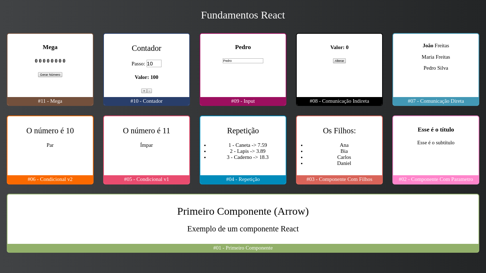

<h1 align="center">
  
</h1>

<h4 align="center">
  React JS Curso Rápido ⚛️ Masterclass #1 e #2 - 2020 - 100% Prático!
</h4>

-  [Masterclass #1](https://www.youtube.com/watch?v=XQxitgyZ_S4&t=2226s)
-  [Masterclass #2](https://www.youtube.com/watch?v=GJ8Vm-h0V8I)

## :memo: Licença
Esse projeto está sob a licença MIT. Veja a [LICENÇA](./LICENSE) para mais informação.

---

Feito com ♥ por Vinicius Pimenta :wave: [Entrem em contato!](https://www.linkedin.com/in/vinicius-pimenta-195b04181/)
